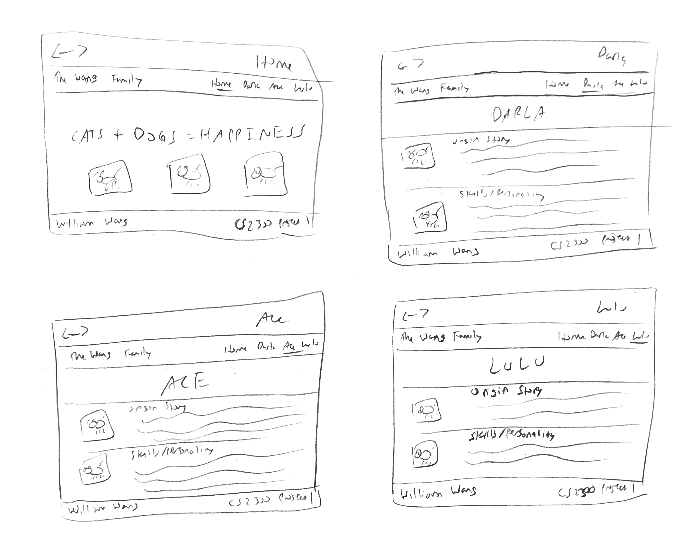
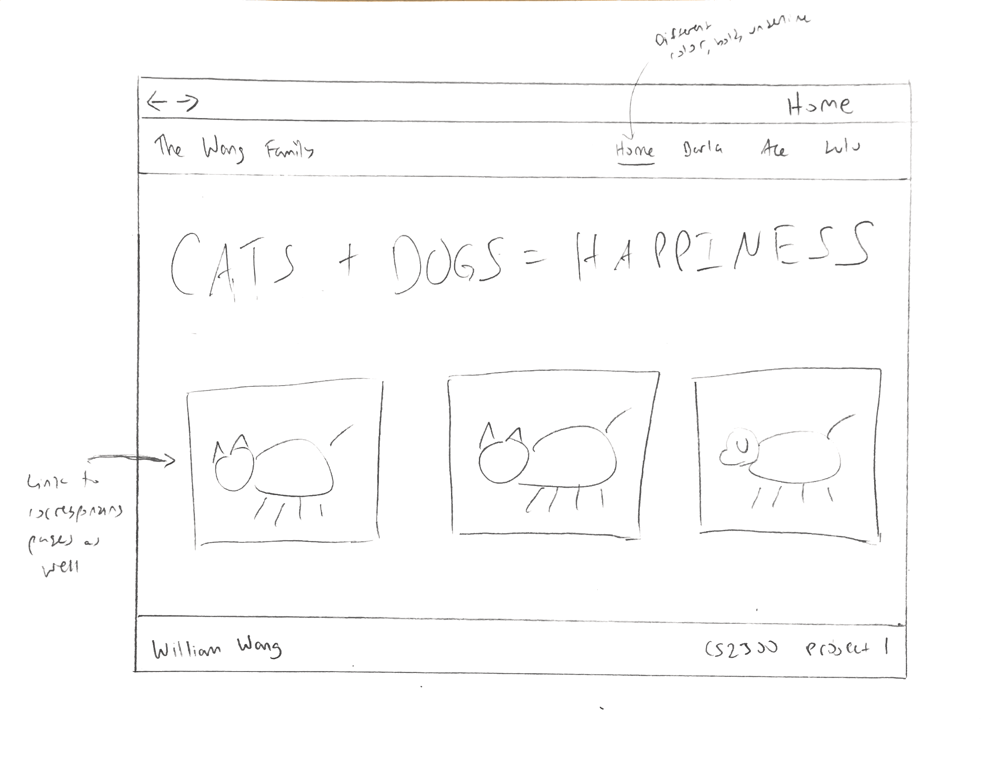
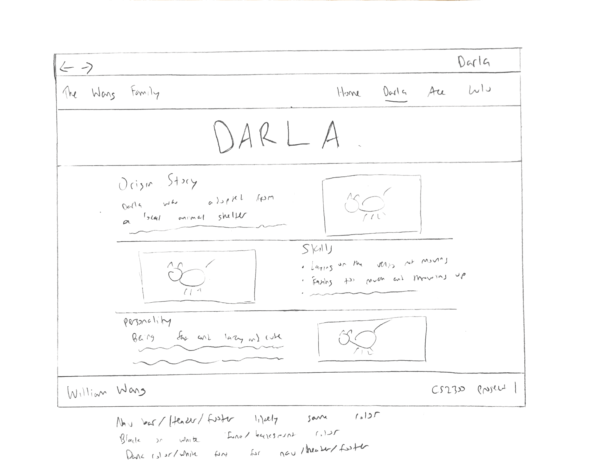
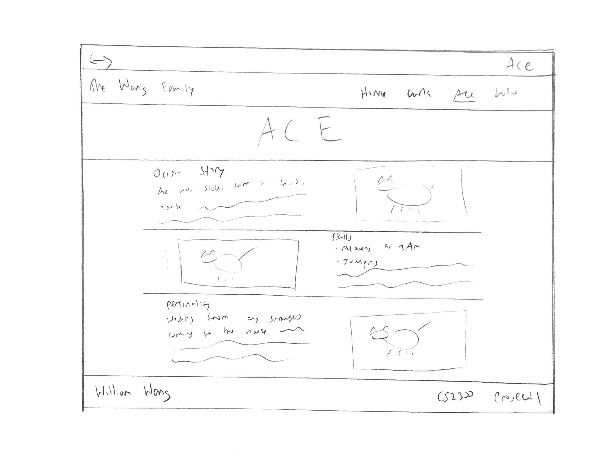
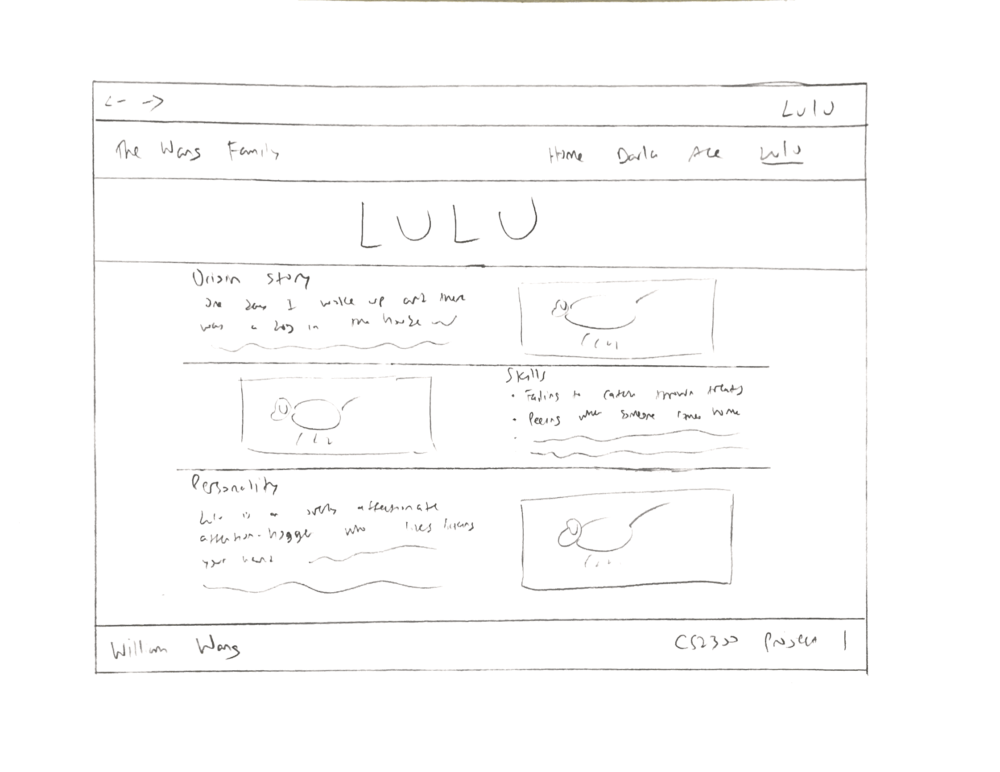

# Project 1, Milestone 1 - Design & Plan

Your Name: William Wang

## 1. Persona

I've selected **Abby** as my persona.

I've selected her as my persona because she prefers using familiar things over
learning new ones and will blame herself if she can't figure out how to properly
use a website. Therefore, simple and easy to figure out websites would be good for
her persona to lessen the chance of her getting frustrated with herself. This is
an important characteristic of Abby I considered in choosing my persona because
designing a website that is easy to figure out for anyone using it is very useful.
It would mean that the website would work for any audience of all knowledge levels
and would be suitable for a large majority of potential target audiences.

## 2. Sketches



My sketches meet the needs of my persona Abby because it's a very simple layout.
The navigation menu is kept at the top throughout every page and is clearly labeled
and marked with a line sectioning it off. It is also using a standard design many
websites follow, making it something that is likely already familiar to her.
The rest of the content webpages have an obvious easy to follow arrangement
pattern and readable layout. It also has categories dividing up the information
about my pets and corresponding images divided into visible sections so it is
apparent what goes with what. There is a large header and marker in the navigation
bar to make it clear what page you are currently on. All of these design decisions
should make it very clear what the page is about and what everything on the page does.

## 3. Wireframes






## 4. Coding Plan & Pseudocode

Coding Plan:

* Use PHP includes for an **init.php**, **header.php**, and **footer.php** to
  reduce the amount of repeated HTML.
* Use a variable on each page to keep track what page the user is currently on
and use it to mark the currently viewed page in the navigation bar.
  * To differentiate the current page from the other pages the text and/or background
    will change color, the text will be bolded, and the text will be underlined
    using a different ID to be stylized using CSS.
  * When hovering over a link in the navigation menu it should also have a visual
    indicator like a font color change that shows you are hovering over the link
    using the hover property in CSS.
* Create an associative array in **init.php** that has the page names and file names
  for each web page for use when displaying the navigation bar.
* In **header.php** loop through the associative array created in **init.php**
  to display the links for the navigation bar
  * If the current page matches the current page variable, change the HTML ID to
    match the CSS ID used for the current page.
* Create user-defined functions in **init.php** that take in strings of text for
  the page label/origin story/personality sections and an array for the skills/images
  section.
  * The strings can contain the whole paragraph description, the array for the
    skills will have one skill description per array ID and the array for the
    images will have the image filenames.
      * Loop through the array of skills and image filenames to display them on
        their corresponding pages.
  * The function will take the text inputted into the function and output the text
    into an HTML template that is the same across the pages for every pet.
  * There will be separate functions for each major section of the web page.
* In **footer.php** there will be the footer text and label to put at the bottom
  of every web page.
* PHP file layout:
  * At the top of the PHP file, change the value of the variable keeping track of
    the current pages.
  * Then include **init.php** and **header.php**.
  * In the main body of the HTML code for the content webpages there will be the
    user-defined functions dividing up the page into the main sections with the
    customized text as the function input.
  * Then include **footer.php**.

Pseudocode:

```
// Used for DARLA/ACE/LULU label section of each pet page
function print_page_header(page_name)

  print out page_name in HTML heading tags

end function
```
```
// Used for Origin Story and Personality sections on each pet page
function print_description(text, file_name)

  print out text enclosed in <p> tags

  print out image file name and source information inline

end function
```
```
// Used for Skills section on each pet page
function print_skills(skills, file_name)

  print out image file name and source information inline

  for each (skill in skills)

    print out skill in a <li> tag to be put in an unordered list

  end for each loop

end function
```
```
// Goes in header.php
for each (page in pages)

  if page is current pages

    print page with hyperlink and with current page CSS ID

  end if

  print page enclosed in hyperlink to filename

end for each loop
```
```
// Used to print the images on the homepage
for each (file name in file_names)

  print images inline on home page with hyperlink

end for each loop
```

Decided that it was not necessary to use page header function due to small amount
of code required to make it in HTML.
